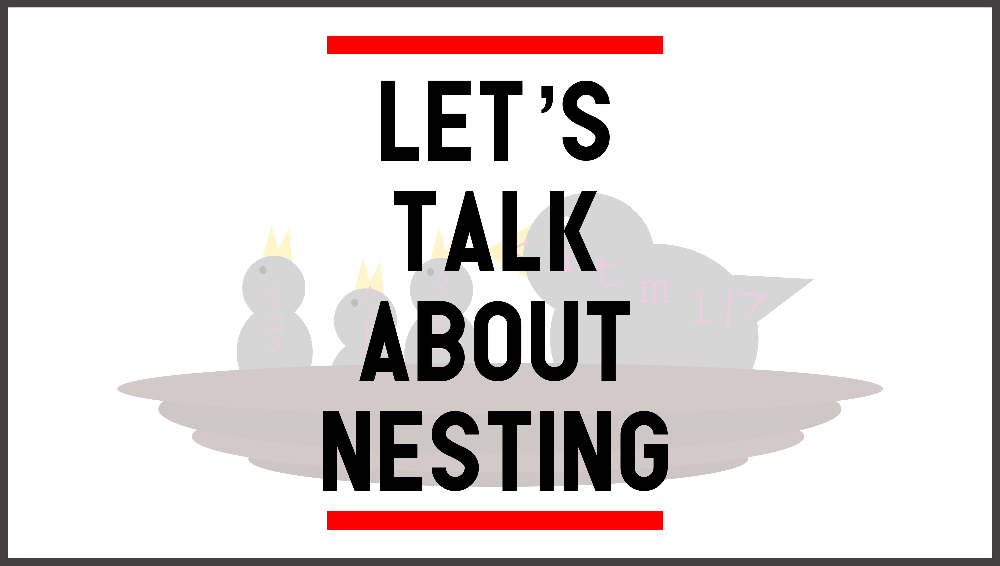

Nesting is a crucial part of your HTML's structure. We talked about nesting a bit in a [previous post](https://www.frontamentals.com/html-intro) just to get your feet wet but in this post we are going to talk about what nesting is, why it is important and some best practices to get your code looking 👸. A bonus to learning a proper nesting structure? You can use what you learn here in a lot of other parts of your code like JavaScript and SCSS but that is more for another day of learning.

### ✅ This is nesting
```html
  <div class='parent'>
    <p>I am a child</p>
  </div>
```

### ✅ This is nesting too!
```html
  <article class='article-wrapper'>
    <h1>Nesting HTML Elements</h1>
    <h4>February 12, 2018</h4>
    <div>
      
    </div>
    <p>Nesting is a crucial part of your HTML's...</p>
  </article>
```

### ❌ This is how trust is broken and bad things happen to good people
```html
  <div>
      <span>Some text goes here, right?</span>
        </div>
      <div><h1>My story will go in this paragraph...</h1></div>

                
<div id="div">
something else</div>
```

Maybe you are looking at the above examples and thinking "Those all seem the same? Why can't I just code, bro?" First of all, great question. Secondly, don't call me bro, man.

There is a fine line in coding and then coding bad habits. It can be difficult to tell what direction you are headed, especially when you starting out. I actually quit my very first job as a developer after three whole days because I had no one to look up to or get guidance from (post on finding a good mentor coming soon). My wife nearly killed me. Hopefully Frontamentals can be your online guide.

## Next stop...Nesting!

Let's imagine you just landed your first job as a developer at Tesla, Google, Facebook, Sweet Consulting Agency (take your pick). Your first assignment is to add in some content to their home page. This is a high profile task because everyone will see it. You crack open DreamWeaver (because in this hypothetical, you are making a lot of bad decision still) and start hammering away at the code. A couple div's here. A span there and VOILA you have yourself a beautiful page. You send it to your Quality Assurance team because that is just how your company rolls. You pack up your laptop, head for the bus and slowly drift into a dream state while listening to Kickstart My Heart by Mötley Crüe. You get a Slack notification

> *What the HUG is this? Did you code this in Microsoft Word? Don't come back tomorrow...*

Don't let this be you. Instead, follow along with these articles and level up those skills.

## Why is it called nesting?

It is called nesting because you are structuring your code to have a parent to child relationship. Check out this example:

```html
  <div class='parent'>
    <div class='child one'></div>
    <div class='child two'></div>
    <div class='child three'></div>
  </div>
```

The child divs are all nested withing the parent div. I also like to think that if you turn your head it sort of looks like a birds nest. Keep in mind there can also be a several level deep relationship and what were once children, could now be parents to their children. Just like humans.

```html
  <section class='main'>
    <h1 class='title bold'>Super Corp.</h1>
    
    <div class='tagline'>We get stuff done</div>
  </section>
  <section class='parent'>
    <div class='child one'></div>
    <div class='child two'></div>
    <div class='child three'></div>
    <div class='child four'></div>
    <div class='child five'></div>
    <div class='child six'></div>
    <div class='child seven'></div>
    <div class='child eight'></div>
    <div class='child nine'></div>
  </section>
  <section class='team'>
    <div class='employee'>
      
      <p>I work on the website</p>
    </div>
    <div class='employee'>
      
      <p>I am the CEO</p>
    </div>
    <div class='employee'>
      
      <p>I work at Super Corp.</p>
    </div>
  </section>
```

See how easy it is on the eyes to scan the code and see where each piece of information goes? One day you will be debugging, or trying to find out where something has gone wrong, and thank me for teaching you to structure your code like this.

## Why you should nest

I will say this often throughout Frontamentals but let me make sure it is clear this time

# YOU CODE FOR YOUR TEAMMATES, NOT YOURSELF

You will almost certainly at some point in your career write code someone else will eventually have to work with. Treat others as you would like to be treated and leave it better than you found it. If you are having a difficult time following what is happening, your teammates will too.

You should also care about a proper structure and nesting because it is more accessible meaning that more people can use what you create. Newsflash: Not everyone that uses the internet can see. Some people rely on screen readers to tell them what is happening on the screen. If your HTML looks like dropped a bunch of tags from 30 feet and kept what stuck, a screen reader won't have a clue how to decipher it.

> *Browsers are advanced now Bryan. They will format it for me...*
>
> -Snooty you

One of the best pieces of advice I was ever given was to 

> "Code your websites like the worst possible user experience will happen. Because it will"

Eventually you will have a user that isn't using the latest version of Chrome or Firefox (Hi Grandma 👋). Oh, and they are visually impaired. And they wanted to invest 10 billion Schrute bucks into your site because they heard how cool it was but then their experience was awful. Sad story.

The biggest piece of advice I can give you is to indent and nest your code and you are doing it. You just cut a huge section of code? Before you paste it somewhere else, fix up your current code. Or better yet, let your text editor do it for you. A lot of text editors have some sort of auto-formatter built in. Your co-workers will thank you.