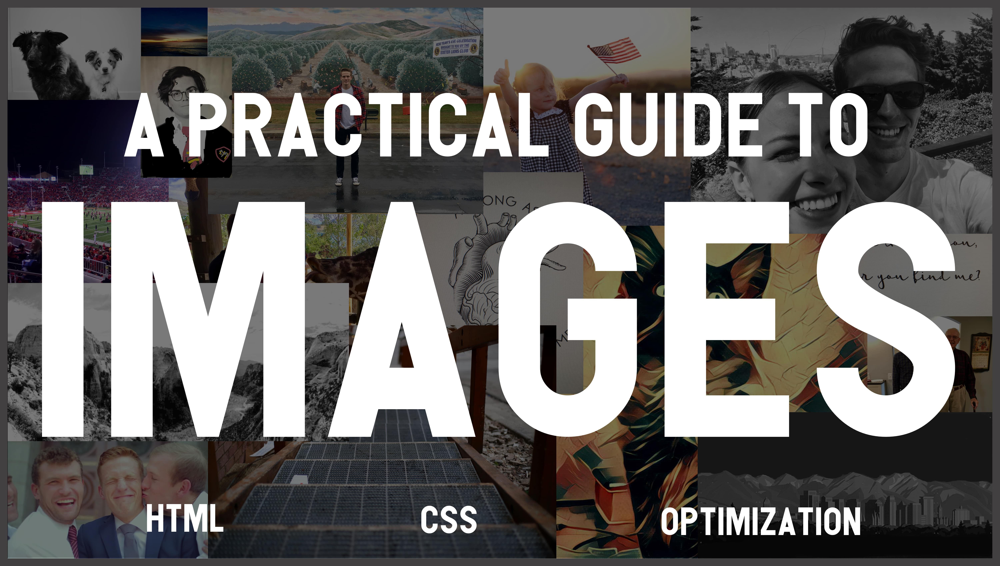

Before we get started I want to talk about a little hubris that happened this week on the internet. There I am scrolling through Twitter and I start to notice that a lot of people I follow are quote tweeting someone. Long story short, someone who I had never heard of but I am sure is very important said:

>"If people who don't know you can use a &lt;link> tag can call themselves front-end developers nowadays I'm proud of saying they don't belong in our craft."

If you are learning to code (keep learning!) or know how to code (keep teaching!), don't listen to that 💩. There are areas we can all improve as developers. If you ever meet someone that says they know absolutely everything about code, they are lying.

Let's get back to what we came here for.

# Images

I absolutely love pictures. As a kid, I would go to the library and check out research books because I felt that they had the best looking pictures. I love photography as well. Most of all, I love the story a picture can tell without any words at all. A well placed image can do more for the vibe of a site than almost anything. There are quite a few ways to accomplish the goal of getting an image on your site so let's talks about those different ways and some optimization tips along the way!

## &lt;img> tag

Take a peek at this code:

```html

```
You will notice that there is a `src` and a `alt` attribute. Only the `src` attribute is technically required for our image to work but going back to our <a href='/html-nesting'>HTML Nesting</a> post, we want the web to be accessible so I am going to tell you that the `alt` attribute is required and you should always include it. There are a handful of other attributes as well that we will cover a bit later on.

### `src`&nbsp;attribute

The `src` attribute is telling our `` tag where it can find the image to display. In the example above, it is saying that our image lives in the same directory as we are currently in and is named `images.jpg`. If the image I wanted to include was hosted somewhere else on the web, I could have included a URL there instead. Don't do that unless you are 100% certain that your image will always be hosted at the location you a referencing. You may be saying right now:

> "Of course my image will always be hosted at that location..."

STOP. THAT. THINKING. Did you ever use MySpace? Exactly. I don't know anyone who regularly uses MySpace anymore but at one time it was *the* social network. You could always rely on your top 8 to exist and link to their images. Then Facebook came out and that brings us to today. It is better to reference your images locally. When I say locally, I mean in your project. Create an `images` folder in your project and reference the image from there.

Along those same lines, don't ever, ever, ever steal images off the internet. No matter how cool that picture is, someone else worked to create it. There are so many free options for pictures and it is lazy to do a Google search and take the first one that looks cool. You are better than that.

### `srcset`&nbsp;&  `sizes`&nbsp;attributes

What's this? `srcset`? `sizes`?

You, like a lot of people, enjoy surfing the web 🏄. You like to do it on your laptop, you like to do it on your phone. You also, like some developers, enjoy creating websites that look great on both a laptop and a phone. If you are still reading then `srcset` and `sizes` is for you!

Take a peek at this code and we will breakdown what I am talking about:

```html
  
```

Don't worry if this all feels like a lot right now, because it is! You are probably even thinking to yourself "I thought web development was getting easier! This looks more difficult to me." There is definitely more information here than we saw before but here is the big win; optimization. It is one thing to have a great looking site and it is another to have a great looking site that loads fast. The only people that are willing to wait around for your site to load are you and possibly a loved one and even then that is a stretch. One of the biggest causes of a slow loading page is poorly optimized images.

Quick recap on me: I am Bryan, I love to code and spend time with my family and I work as an instructor at a coding boot camp. Nice to meet you.

All too often when I am helping a student that is creating an image intensive website, I will see page load times up near 6 or 7 seconds. Luckily, there are a lot of tools we use that help with this out of the box (Gatsby & Create React App to name a few). I will inspect an image and in some cases they will be sending an enormous 10MB image down to be displayed. Sometimes that image is even being shrunk down with CSS to only be about 300 pixels wide. That is just too much wasted time. This is where `srcset` and `sizes` come into play. Let's look at the above code snippet again and then break down what is happening.

```html
  
```

`srcset` is allowing us to send over a group of sizes the browser can choose from. It goes in this order `nameOfImage` -> `images width using w NOT px` -> `,`. This will give us greater flexibility when loading images in the browser.

Next, `sizes` is what will give the browser some clues as to what needs to happen. Essentially the browser will evaluate the sizes attribute and when it evaluates to true, it will select the image that will best fit in the predefined size. I'll explain further. Pretend to be your favorite browser. You see an img tag and then need to decide what image will best fit our current resolution. 

* Is our resolution 320 pixels or less? Nope. Keep going. 
* Is our resolution 480 pixels or less but more than 320 pixels? No. Keep going. 
* Is our resolution less than 800 pixels but more than 480? Yes! Great, load the image into a width of 770 pixels.

The 1200px size is for anything that doesn't fit that criteria and will be used on wider screens.

> "What is the benefit?"

The benefit is that instead of always sending that enormous, 10MB image to be downloaded by the browser, you sent a much smaller image that was only half that size and saved you a considerable amount of load time. Your users loved it and an investor wants to give you so much money for your awesome website. Congratulations!

> "What is the drawback?"

The biggest drawback is that you will have to have or create all of the sizes of images you specified in `srcset` and sometimes that can be more easily said than done. Not to be worried though, we will talk about some other optimization options when we only have a single image to work with.


### `alt`&nbsp;attribute

The `alt` attribute is text that will display when the image isn't there and is helpful text for screen readers. Look at these two broken &`` tags;

 

And

 

Notice how the second image has text to go along with it but the first is just a sad display of 404's. If for whatever reason your image didn't properly load, your users would be out of luck knowing what the image was of. What a horrible user experience. I am purposefully sending over two images that will result in a `404 (Not Found)` so you sure as hell better start using an `alt` tag.

Oh, one more thing on `alt` tags is that you don't need to say `alt='image of...'` or `alt='picture of...'`, browsers and screen readers are smart and already know from the `` tag that it is working with an image.

### `height`&nbsp;&  `width`&nbsp;attributes

You may come across the `height` and `width` attributes, especially when your images are being rendered from a server. These two attributes do exactly what you think they will do; adjust the height and width of the image. This type of adjustment is considered `inline` and should be avoided. You are better off styling your image with CSS. It is a real pain when you can't figure out why your image is constantly staying at 500 pixels even though you have adjusted it in the CSS and then come to find out it was set inline on the `` tag. One use case for inline styling is HTML emails. If there is enough demand, I will do a little tutorial for HTML emails which are just their own beast.

## CSS `background: url();`

Another common option of displaying images on your site is the `background` property in CSS. This can be used to also change the color of your background. It is common to see it used like this:

```html
  <!--HTML-->

  <div class='hero'></div>
```
```css
  /*CSS*/

  .hero {
    background: url('./images.jpg');
  }
```

Think of the `background: url()` as similar to the `src` attribute. Both let the browser know where to find the image to display on the screen. Don't mind that is says url as it can be a local file as well.

There are a few properties that run in the same pack, or associate with `background: url()`. In fact, `background: url()` is just shorthand for `background-image: url()`, they work nearly interchangeably. Let me go on  mini detour here. CSS has quite a few shorthand, or shortcuts, to make life easier. Instead of typing out

```css
 .test {
    margin-top: 10px;
    margin-right: 10px;
    margin-bottom: 10px;
    margin-left: 10px;
 }
```

We can write

```css
  .test {
    margin: 10px;
 }
```

We can do the same with background images. Instead of explicitly defining different parts of our image like if we want it to stretch across our div, repeat or be centered, we can combine all of that information right into our `background` property. Take a peek at the following pen for more details.

<iframe height='500' scrolling='no' title='Frontamentals Guide to Images' src='//codepen.io/beeg/embed/GQQNwM/?height=500&theme-id=0&default-tab=css,result&embed-version=2' frameborder='no' allowtransparency='true' allowfullscreen='true' style='width: 100%;'>See the Pen <a href='https://codepen.io/beeg/pen/GQQNwM/'>Frontamentals Guide to Images</a> by Bryan Smith (<a href='https://codepen.io/beeg'>@beeg</a>) on <a href='https://codepen.io'>CodePen</a>.
</iframe>

You can see that the two images end up the exact same. On the second image, everything concerning our background image is set right into our `background` property making it cleaner and less things to worry about as our CSS file grows.

## &lt;img> tag vs CSS background

It can be difficult to know when to use an `` tag and when to use the `background` CSS property. Whenever I am deciding which to use I think to myself "Is the image part of the flow of my site? Does the image provide meaning besides its good looks?" If I answer yes to either, I use an `` tag. Remembering back to <a href='/html-intro'>Intro to HTML</a>, we want our tags to be semantic or have meaning. If we create a `div` and put an image as its background, we are saying that the image is mostly their for appearance or we like the way it looks. That is just the baseline I use and it has generally worked out pretty well for me so far but know that there any many different use cases.

## Optimization

Back to sending 10MB pictures to the browser to load. We can greatly increase the speed and performance of our site by optimizing our images. Take a look at these two images and tell me what the difference is.


<br>

<br>

You are probably thinking they are the exact same image. Content-wise, they are the same image. File size-wise they are hugely different. The first image is about 900kb in size and the second? That bad boy is coming in at just over 10MB. That means that the first image is almost 10 times smaller than the second. That might not seem like a big deal and it probably won't be until you make an Instagram competitor aimed solely at pictures of peoples food. Because you are loading in quite a few images at a time, your site is going to load considerably slower than a site with better optimized images.

One awesome part of the web is that you don't have to be skilled in Photoshop to optimize your images. I send most of my images through [TinyJPG](https://www.tinyjpg.com) or [Optimizilla](http://optimizilla.com/) even after I'm done in Photoshop and these options are totally free which makes it that much better.

## Types of Images

This post is already getting a little lengthy so I will try to be succinct with this last part. There are many different types of images but the most common you will run into are .jpg, .png, .svg and .gif(just for fun).

* **.jpg:** Garden variety image format. Probably the most commonly used.
* **.png:** Portable Network Graphic. Looking for an image with a transparent background? Most likely a .png
* **.svg:** Scalable Vector Graphic. These images will look good at a wide variety of sizes as they scale very well.
* **.gif:** Jif or Gif? Doesn't matter. Most commonly used for animated images. I pronounce it Hif, just to throw people off.
