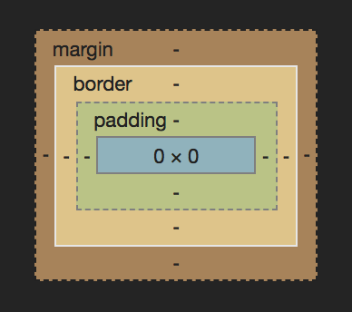
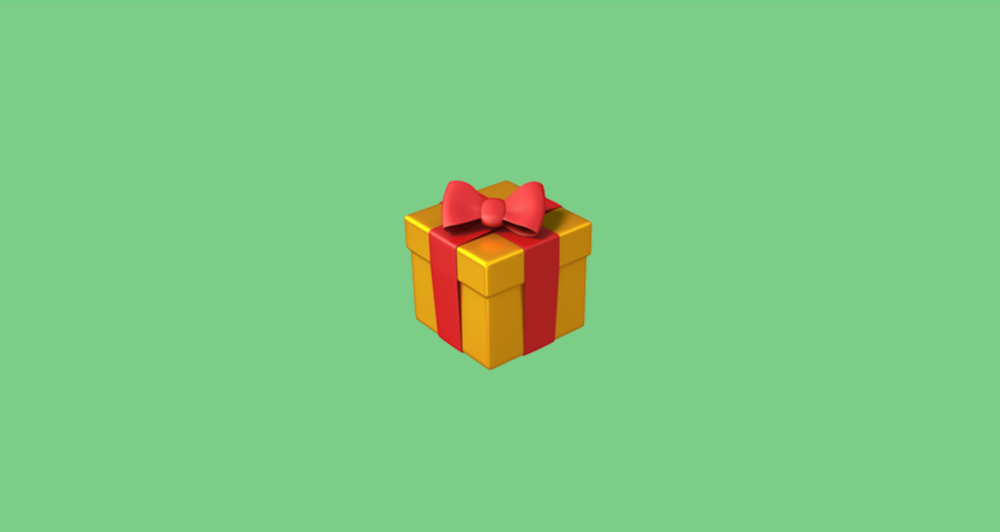

Understanding the CSS Box Model is an important aspect of being able to master how elements are laid out on a page. In the most basic of terms, the Box Model is as follows: Margin, Border, Padding and Content. But what does that all mean? How do these words work together? Welp, in this weeks post we will jump right into it and have you feeling like a Box Model Master. Styling elements and giving them proper spacing left and right (and top and bottom...get it? Because you are arranging your elements on the page 😂...sorry for the bad jokes).

Take a peek at this visual break down provided by the Chrome Console:



> *You can see this visual by right-clicking your page in Chrome (or your browser of choice), clicking Inspect to open the developer console, selecting the Styles tab and then scrolling down to the very bottom.*

You can see that each part of the Box Model is labeled for you except Content, that is the blue box in the very middle. Lets break down how each part works and the unique differences between them.

## Margin
You can think of margin as a buffer for your element. You want a little space around it? That is what margin is there for. Let's imagine you have a cold. You should (hopefully) be staying away from people so you don't spread it around. You need some margin around you. Take a look at this image to further illustrate:


<br>

Notice how your friends are all spread out from you and surrounded by orange? That is margin in action. You remain the same size but there is a no-entry zone for all things around you. Same thing goes for elements on your page. Margin will give you space around your element and keep things separated. To put it simply, margin will put invisible spacing around your element without directly effecting its size but in this example we made it orange to give you a visual cue of where it stands relating to the content (a sick you in this case).

## Border
Border is the second property from outside edge of your element. Border, as I am sure you have guessed, is used to define a visual edge to your element. Border will increase the presentational size of your element or the part that is visually seen on the screen. There can still be margin involved but it will be on the outside edge of the border. Lets take another look at you being sick but this time with a little border involved.


<br>

It looks almost identical to the margin demo before it except there is now a black box around it. That is our border. One thing to remember is that our content (the sick emoji) is now the size of the emoji plus the border on each side.

Okay, enough of the sick emoji. Let's talk about padding.

## Padding
Padding is the third item fro the outside edge and like margin and border before it, is totally optional. The biggest thing to keep in mind when trying to find the difference between margin and padding is that padding WILL increase the presentational size of your element. Let's imagine your grandmother is sending you a birthday gift. She packs it up and sends it off in the mail. Now, being that your grandmother doesn't want your present to get ruined while being sent to you, she really adds to the packaging. Here is a visual for what I mean.



<br>

You receive the gift and assume that grandma went all out and got you a 60 inch tv. Wrong. She just added some padding (see what I did there?) to the box that made it take up more space and appear bigger.

Let me give you a relevant coding example. You create a `<div>` that is 100px wide by 100px tall. You add 10px of padding to each edge and now that `<div>` is 120px wide by 120px tall because of the added padding on each side. Keep that in mind as you are laying out the elements of your page.

## Content
Content, content, content. This is what our page is made of. This is what "brings the boys to the yard" as Kelis would say. Content is how you initially describe it in your CSS or it's natural height if you are using an image. You created a `<div>` that is 50px wide by 300px tall? That is how much real estate on your screen that it will take if it isn't altered by any of the above parts of the Box Model. Content is the present your Grandma gave you, it is the sick emoji.

## Box Sizing
I would be remiss if I didn't mention `box-sizing: border-box` right now. I don't want to dive too deep into the specifics of it but there is a CSS property called `box-sizing` that defaults to `content-box` for its value. Take a look at this CodePen to demonstrate. The children have no respect of the parent container, extending out of it.

<iframe height='750' scrolling='no' title='Frontamentals - Intro to Box Model pt 1' src='//codepen.io/beeg/embed/KQLvwL/?height=750&theme-id=dark&default-tab=result&embed-version=2' frameborder='no' allowtransparency='true' allowfullscreen='true' style='width: 100%;'>See the Pen <a href='https://codepen.io/beeg/pen/KQLvwL/'>Frontamentals - Intro to Box Model pt 1</a> by Bryan Smith (<a href='https://codepen.io/beeg'>@beeg</a>) on <a href='https://codepen.io'>CodePen</a>.
</iframe>

And now with the power that is `box-sizing: border-box`:

<iframe height='500' scrolling='no' title='Frontamentals - Intro to Box Model pt 2' src='//codepen.io/beeg/embed/vdwJNW/?height=500&theme-id=dark&default-tab=result&embed-version=2' frameborder='no' allowtransparency='true' allowfullscreen='true' style='width: 100%;'>See the Pen <a href='https://codepen.io/beeg/pen/vdwJNW/'>Frontamentals - Intro to Box Model pt 2</a> by Bryan Smith (<a href='https://codepen.io/beeg'>@beeg</a>) on <a href='https://codepen.io'>CodePen</a>.
</iframe>

The children are now contained inside of the parent (and probably doing their chores and coming home by curfew). The CSS is the exact same in each demo except for one small addition to the second one:

```css
*, *:before, *:after {
  box-sizing: border-box;
}
```

These three lines are telling every element on our page to calculate their width and height with border and padding added to it where as the first demo was a free wheelin` mess that didn't respect anyone or anything. The padding and border were added to the width and flowed outside of the parent container.

## Wrapping it all up
The box model is fundamental to understanding how things will layout on your page. Hopefully now you have a great understanding of how the Box Model works and how you can use it to your advantage. I also hope this means no more typing "margin: 10px;...[wait for page changes...delete, delete, delete] padding: 10px...".

<div style="width:100%;height:0;padding-bottom:50%;position:relative;"><iframe src="https://giphy.com/embed/d2YVk2ZRuQuqvVlu" width="100%" height="100%" style="position:absolute" frameBorder="0" class="giphy-embed" allowFullScreen></iframe></div><p><a href="https://giphy.com/gifs/psa-the-more-you-know-public-service-announcement-d2YVk2ZRuQuqvVlu">via GIPHY</a></p>