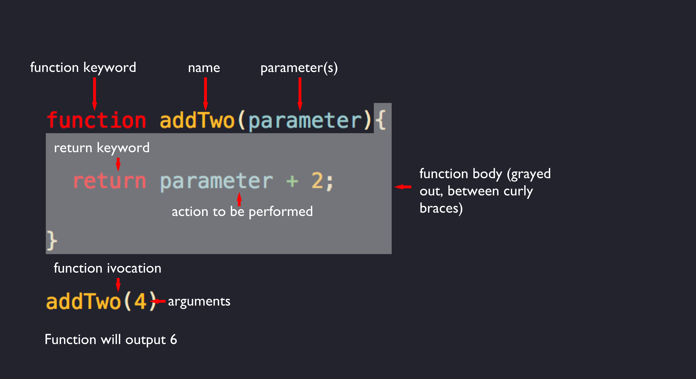

Take a look at those robots up above. Aren't they cute? Now just imagine yourself being some sort of scientist that has created a bunch of robots and they do exactly as you tell them to. You want one to walk the dog or hell, be your dog? Just program it to do so. Want one to clean all your dishes? Just make sure it can withstand the water. Oh, how about one that will brush your teeth, get you dressed and do your hair? That might be a little difficult but after some trial and error, I am sure you will be able to sort that out. Now picture yourself sittin' back and enjoying the good life because all of these tasks have been automated for you. You simply had to figure out how to make it work and now these robots do it for you. You, my friend, are one awesome scientist.

I am sure you are seeing where I am taking this but incase you flew right passed you, functions are just like little robots. They do exactly what we tell them to and once you are done with this article, you will be well on your way to becoming whatever the web developer version of a mad scientist is. We did briefly cover function in JavaScript in an earlier post, <a href='/intro-to-javascript'>Intro to JavaScript</a>, but this will be a deep dive! Now let's throw on our virtual lab coat and glasses because here comes some learning!

There are several ways to declare functions in JavaScript. For the most part, they will give you the same results but they are structured differently. Lets start with the different parts of a function.


<br>

## Function Keyword
The function keyword is what lets us know that we will be creating a function. Up until Ecmascript 6(ES6), you needed to use the function keyword but ES6 included a new way to declare a function called an arrow function that we will talk about more later.

Quick side note: You may have read Ecmascript and though of eczema or some kind of rash but it is actually the standardization of JavaScript. It basically is where JavaScript gets all its traits from. Think of it like a parent of sorts even though it is a lot more but I didn't want to leave you in the dark.

## Function Name
In specific type of function above, known as a declaration, the function name comes following the function keyword. We could quite literally name the function anything we wanted to. It helps to be descriptive when naming your function. A coworker should be able to read it and know exactly what it is going to do. I always tell people to lean towards having a longer function name if it means that it is descriptive but short and sweet can't be beat (thanks Dr. Seuss for the rhyme).

## Parameter(s)
Functions can optionally take in parameters. Parameters are just placeholders for information that will be filled in later when we invoke our function. One thing that hangs up a lot of people is that whatever you call the parameter when you create it, you need to call it the same thing when you are deciding what sort of action you want your function to perform. Take a look at this example.

```javascript
  // this works fine
  function addNameToArray(arr, name){
    arr.push(name)
    return arr
  }
  var names = []
  addNameToArray(names, 'Bryan') // outputs ['Bryan']

  // this will think you are insane
    function addNameToArray(arr, name){
    a.push(b)
    return a
  }

  var names = []
  addNameToArray(names, 'Bryan') // outputs ReferenceError: a is not defined 💀
```

One of the best ways I have ever heard a function be described is as a child. It is the most temperamental thing ever and the smallest thing can totally throw it off into a temper tantrum if it doesn't get just what it wants. It will refuse to do what you want until you give it what it wants. Hopefully that was illustrative enough.

One more key thing to parameters is that their naming doesn't matter, call them whatever you want (but it should make sense) but their order does matter during invocation. If I tried to pass invoke the above function like this `addNameToArray('Bryan', names)`, it would tell us that names is `arr.push is not a function` and that is because it is trying to peform the built in `.push()`, which just adds whatever is inside the parentheses to the end of the array, on a string ('Bryan'), and that just won't work.

## Function Body
Next comes the function body. This is where, as they say, the magic happens. Looking at our example above we have a return keyword and then the action we want our function to perform. This could be literally anything. Whatever you decide as the developer, that is what our function will do. It is awesome! One thing to keep in mind is the `return` keyword. When a function runs into the return keyword, it will execute the line it is currently on and then end. If you have something you want to run below the return statement, you are out of luck. Check out the demo below (Press the triangle in the bottom right corner to run).

<iframe height="400px" width="100%" src="https://repl.it/@bryanSmith33/Frontamentals-JavaScript?lite=true" scrolling="no" frameborder="no" allowtransparency="true" allowfullscreen="true" sandbox="allow-forms allow-pointer-lock allow-popups allow-same-origin allow-scripts allow-modals"></iframe>

It is a basic function that just returns two numbers added together. We then console.log (a way to output information to the developer console, which can be accessed by right clicking and choosing 'inspect' or cmd/ctrl+i on your keyboard. Maybe just opened a can of worms on you there.) the name we pass in to the console. But wait! The name never arrives and that is because the functions execution ended as soon as it finished the line with the return statement.

Another thing to keep in mind is that all of your logic (or the stuff you want your function to do) needs to be inside of the curly braces.

## Function Invocation
This is where our function is finally put to the test. This is essentially the on switch to the robot. You can write functions all day long but it won't matter unless it is invoked. Here is a quick refresher on the first example so you don't have to scroll back up again.

```javascript
  function addTwo(parameter){
    return parameter + 2
  }

  addTwo(2) //outputs 4
```

You can see the function keyword, the name, the single parameter and then our logic in the function body. Finally we come to the function invocation. Now the one difference here is that we have passed in 4 to our function. Remember how I said that our parameters are just placeholders? Well that is because they are. When we invoke the function, we pass in our actual data we want it to work with. When we invoke the function, whatever is between the parentheses is known as an argument. When we are creating the function, whatever is between the function is an parameter. Remember that as I am certain someone will ask you that in an interview.

Okay so now that we have a baseline understanding for the different parts of a function, let's talk about the different ways you can create functions.

## Function Declaration
The above examples were all function declarations. This is the type of structure you will most commonly use when you are creating functions. You start with the `function` keyword and then whatever you want the functions name to be. Here is an example.

```javascript
  function findPerson(array, name){
    for(let i = 0; i < arr.length; i++){
      if(arr[i] === name){
        return `${name} is in the array!`
      }
    }
    return `${name} is not in the array`
  }

  let myFriends = ['Lindsey', 'Landy', 'Sperry']

  findPerson(myFriends, 'Landy') // outputs `Landy is in the array!`
```

Don't worry so much about what is happening in this function. Remember, I will expose you to some things in articles that are outside the scope of the article because when we go to cover what you saw without any context when it didn't mean anything, you will have a foundation to build upon and not even know it. In the above example, we take in two parameters and then use tha parameters with the help of a for loop (way to search an array) to see if the passed in name is in the array.

One of the biggest things with function declarations is that they are hoisted. What does hoisting mean you ask? Well when JavaScript is executed, all of the global variables and function declarations are moved to the top of the file so there is context to mean. This doesn't mean they know what value they hold, but it will know that they exist. Up to this point we have been writing all of our function declarations and then invoking them, but we could invoke the function above the declaration and it would still run just fine. Peep the example for proof.

<iframe height="400px" width="100%" src="https://repl.it/@bryanSmith33/Frontamentals-Function-Declaration?lite=true" scrolling="no" frameborder="no" allowtransparency="true" allowfullscreen="true" sandbox="allow-forms allow-pointer-lock allow-popups allow-same-origin allow-scripts allow-modals"></iframe>

Isn't that wild? Now this doesn't apply to the other ways to declare functions, only function declarations.

## Function Expression
Function expression is another way we can define a variable. The main parts are the same but some of the syntax is slightly different. Check out this example.

```javascript
  let addThree = function(a){
    return a + 3
  }

  addThree(9) // outputs 12
```

You may be thinking to yourself "How the hell are these different from function declarations?" and that is a totally valid question. The biggest difference is the let (or you could use `var` or `const`) keyword and there is no name given to the function. It is anonymous and only bound to the variable. Other than that, it is all the same. One other key part is that function expressions are not hoisted. If you tried to invoke the `addThree` function before the definition of it, you would get an error.

> *"But I thought variables were hoisted to the top of the file, Bryan?"*
<br>
> *-You*

Yes they are! BUT varialbes values are not known. The best way I can describe this is with an example.

```javascript
  let names = []

  let addName = function(array, name){
    array.push(name)
    return array
  }

  let myName = 'Bryan'

  addName(names, myName) //outputs ['Bryan']
```

When our above code is executed, it is actually seen as this by our browser (or wherever it is being interpreted).

```javascript
  let names, addname, myname // notice how these are all moved up to the top and then given values below

  addName = function(array, name){
    array.push(name)
    return array
  }

  myName = 'Bryan'

  addName(names, myName) //outputs ['Bryan']
```

The code would work just fine but if we were to try to invoke `addName` above the definition, it wouldn't have a clue as to what it wanted us to do. Commit this to memory.

Another defining characteristic is that function expressions can be anonymous or named. All of the above expression examples have been anonymous. We could have just as easily done something like this.

```javascript{1}
  let addThree = function myFunc(a){
    return a + 3
  }

  addThree(9) // outputs 12
```

There is really only one gain by giving it a name after the function keyword

* There is something called recursion and it is basically when a function calls itself. Named function expression can call themselves.

Recursion is just like JavaScript inception. It is wild until you start to use it and then it all makes sense. Similar to deodorant.

I very rarely name my function expression and I even more rarely use a regular function expression. What I will use instead is an arrow function, because they are awesome.

## Arrow Functions
Arrow function were a big part of the ES6 update we talked about earlier. They, similar to deodorant again, are very weird at first but once you give them a go you will never turn back! They in the most basic of terms make our function expression shorter. Here is the above `addThree` example written as an arrow function.

```javascript
  let addThree = (a) => {
    return a + 3
  }

  addThree(9) // outputs 12
```
You can see we lost the `function` keyword and instead gained the `=>` syntax. It feels so wrong at first and makes no sense but hang with me here. We could write the above example just like this to make it short and sweet which is really my motto (as long as it still makes sense).

```javascript
  let addThree = a => a + 3

  addThree(9) // outputs 12
```

BOOM! ONE FREAKIN' LINE MY FRIENDS! I love it. We lose the parentheses and the return keyword. Pure beauty. But how? Let me tell you!

First off when using an arrow function, if you have a single parameter, you can omit the parentheses. I myself keep them 100% of the time because I think it is annoying to add them back in later if you need to adjust your function but just know it is there, if you are into that kind of thing. Secondly, when you put everything on a single line, the `return` keyword is implied. This basically means that there is an invisible return hanging out right after that arrow. If you ever need anything multi-lined, you can't just throw it all onto one line and expect it to work but it is totally fine to multi-line (thanks again, Dr. Seuss). One more thing about arrow functions is that you can name them like you can with function expressions.

I get asked a lot when to use an arrow function and when to use a function declaration. I will almost always use a function declaration unless I am using a higher order function (or function that takes in a function as a parameter but more on those next week) like .map, .filter or .reduce because they specifically return a new array and I need something (a variable) to hold that new array. 

To recap:
* Function Declaration
  * Hoisted
  * `function functionName(parameters){...}` syntax
* Function Expression
  * Not hoisted
  * `let functionName = function(parameters){...}` syntax
  * Can be anonymous or named
* Arrow Function
  * A more concise function expression
  * `let functionName = (parameters) => ...` syntax
  * Can omit parentheses for one parameter
  * Can omit return for single line

  Hopefully you feel like you have a better grasp on JavaScript functions now and feel like you can add them to your web development tool belt.